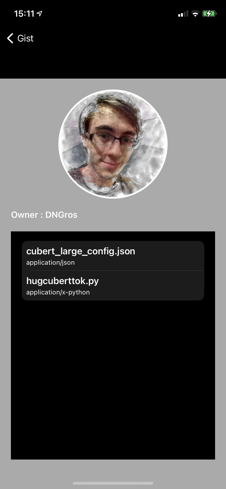

# Gist

 

Gist is an application that i made with love, to make this amazing app I used **https://docs.github.com/en/rest/reference/gists**.

## Architecture

I opted to use **Clean Architecture** because it is easy to separate responsibilities and easy to create tests e with that I have a very good scalability of the project.
Separated by layers:
Configurator
Interactor
Router
View
Worker
Model

### CoreData
To persist offline data I used the native framework, CoreData, It is used to persist, manipulate data in iOS / OSX and uses SQLite under the hood, but you don't need to know SQL to use it, it interacts with sql without you see or need to know what's going on. We use the key / value scheme to access our persisted objects.
    
### Libraries

* **Moya**: For services;

## Screens
### Gist List:
 

### Detail:
 

### Favorite:
 

### File:
 
